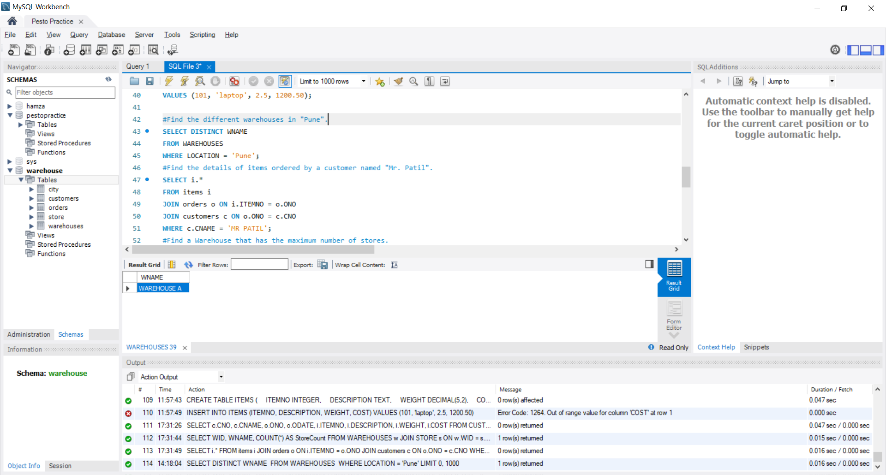
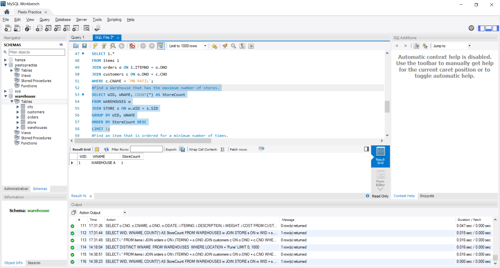
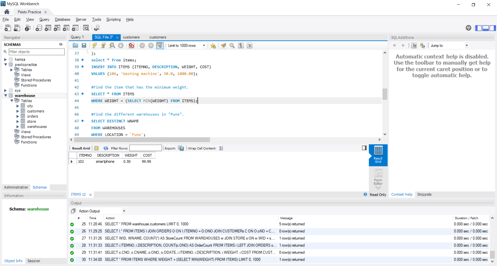
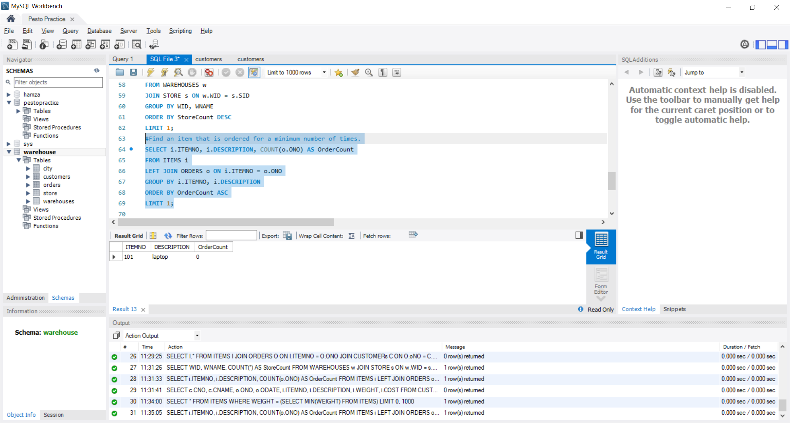

1. #Find the different warehouses in "Pune".

2.#Find a Warehouse that has the maximum number of stores.

3.#Find the item that has the minimum weight.

4.#Find an item that is ordered for a minimum number of times.

   